# Trader Copilot AI — Master Architecture & Implementation Plan

> [!IMPORTANT]
> This document covers all 13 requested deliverables. **No code will be written until this plan is reviewed and approved.** Please review each section and provide feedback on any design decisions, open questions, or concerns.

---

## Table of Contents

1. [Product Requirements Document (PRD)](#1-product-requirements-document-prd)
2. [Technical Design Document (TDD)](#2-technical-design-document-tdd)
3. [Database ER Diagram](#3-database-er-diagram)
4. [PostgreSQL Schema](#4-postgresql-schema)
5. [FastAPI Folder Structure](#5-fastapi-folder-structure)
6. [API Specifications](#6-api-specifications)
7. [Frontend Information Architecture](#7-frontend-information-architecture)
8. [Wireframes](#8-wireframes)
9. [User Flows](#9-user-flows)
10. [AI Architecture Design](#10-ai-architecture-design)
11. [Development Milestones](#11-development-milestones)
12. [Risk Assessment](#12-risk-assessment)
13. [Future Scaling Strategy](#13-future-scaling-strategy)

---

## 1. Product Requirements Document (PRD)

### 1.1 Product Identity

| Attribute | Value |
|---|---|
| **Product Name** | Trader Copilot AI |
| **Category** | SaaS — Trading Intelligence & Risk Management |
| **Target Users** | Retail traders, prop traders, aspiring professional traders |
| **Primary Markets** | Indian equities/F&O (Zerodha, Dhan, Angel One), US equities, Crypto |
| **Monetization** | Subscription tiers (Free → Pro → Enterprise) |

### 1.2 What the Product IS vs IS NOT

| IS ✅ | IS NOT ❌ |
|---|---|
| Risk Management Platform | Trading Bot |
| Trading Intelligence System | Signal Generator |
| Strategy Validation Engine | Auto-Trading System |
| Performance Operating System | Broker / Exchange |
| AI Decision Support System | Charting Platform |

### 1.3 Core Value Propositions

The platform answers six critical questions for every trade:

1. **"How much should I risk?"** → Risk Engine + Position Sizing
2. **"Is this trade valid?"** → Rule Engine Validation
3. **"Has this setup worked before?"** → Similar Trade Intelligence
4. **"What mistakes am I repeating?"** → Behavioral Coaching
5. **"Which conditions favor my strategy?"** → Strategy Intelligence
6. **"Should I take this trade?"** → AI Recommendation (composite)

### 1.4 Core Product Principles

| # | Principle | Implication |
|---|---|---|
| P1 | Risk management always overrides AI | AI can suggest, warn, explain — never force or override |
| P2 | Data drives decisions, not opinions | All insights backed by statistical evidence |
| P3 | Minimize manual input | Only Strategy + optional Notes required from user |
| P4 | AI never fabricates confidence | Must state "Insufficient data" when < 7 days history |
| P5 | Auto-capture wherever possible | Market context, prices, timestamps captured automatically |

### 1.5 User Inputs

| Field | Required | Notes |
|---|---|---|
| Strategy Type | ✅ Required | Select from default or custom strategies |
| Symbol | ✅ Required | Ticker/instrument being traded |
| Entry Price | ✅ Required | Can be auto-filled from current market price |
| Stop Loss | ✅ Required | Defines risk boundary |
| Take Profit | ✅ Required | Defines reward target |
| Order Type | ⬜ Optional | Market / Limit (default: Market) |
| Trade Notes | ⬜ Optional | Free text for journaling |
| Trade Thesis | ⬜ Optional | Reason for taking the trade |

> [!NOTE]
> Everything beyond these fields (position size, risk amount, RR ratio, exposure, market context, session, volatility) is **auto-calculated or auto-captured**.

### 1.6 Default Strategy Types

| Strategy | Description |
|---|---|
| Breakout | Price breaks key level with momentum |
| Pullback | Entry on retracement within trend |
| Reversal | Trend exhaustion / direction change |
| Trend Following | Trading with established direction |
| Scalping | Quick in/out on small moves |
| Range Trading | Mean reversion between support/resistance |
| Custom | User-defined strategy with custom parameters |

### 1.7 Trade Lifecycle States

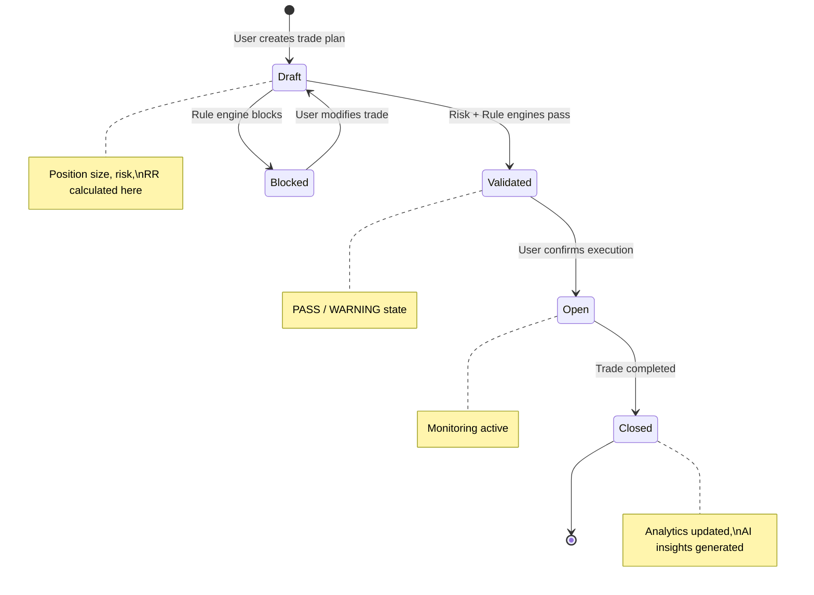

---

## 2. Technical Design Document (TDD)

### 2.1 Architecture Overview

**Pattern:** Modular Monolith (not microservices)

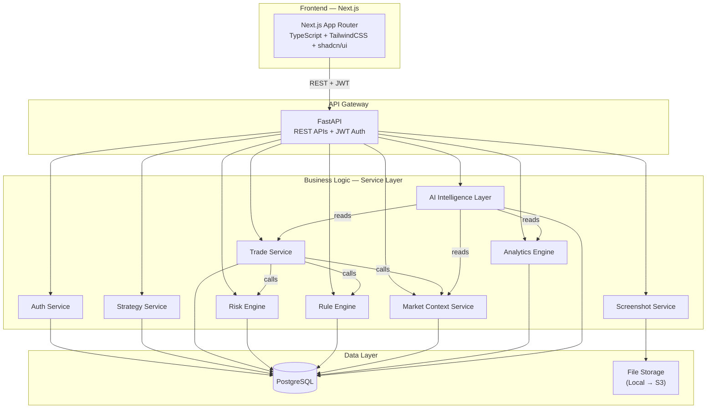

### 2.2 Architecture Principles

| # | Principle | Implementation |
|---|---|---|
| AP1 | Modular Monolith | Single deployable unit, clean module boundaries |
| AP2 | Service Layer Pattern | Thin API routes → Service layer holds all business logic |
| AP3 | Repository Pattern | All DB access through repository classes |
| AP4 | AI consumes analytics, never raw data | Analytics Engine → Feature Extraction → AI Layer |
| AP5 | Risk Engine is source of truth | AI cannot override risk calculations |
| AP6 | Transaction safety | All trade operations within DB transactions |

### 2.3 Technology Stack (Detailed)

#### Backend

| Component | Technology | Version | Purpose |
|---|---|---|---|
| Framework | FastAPI | 0.115+ | REST API, async support |
| Language | Python | 3.12+ | Backend logic |
| ORM | SQLAlchemy | 2.0+ | Database access (async) |
| Validation | Pydantic | 2.0+ | Request/response schemas |
| Auth | python-jose + passlib | Latest | JWT tokens + bcrypt hashing |
| Migrations | Alembic | 1.13+ | Schema versioning |
| Server | Uvicorn | Latest | ASGI server |
| Testing | pytest + httpx | Latest | Unit + integration tests |

#### Frontend

| Component | Technology | Version | Purpose |
|---|---|---|---|
| Framework | Next.js | 15+ | App Router, SSR/SSG |
| Language | TypeScript | 5.0+ | Type safety |
| Styling | TailwindCSS | 4.0+ | Utility-first CSS |
| Components | shadcn/ui | Latest | Professional component library |
| Charts | TradingView Lightweight Charts | Latest | Candlestick / price charts |
| Charts (analytics) | Recharts | Latest | Analytics visualizations |
| HTTP Client | Axios / fetch | Latest | API communication |
| State | Zustand or React Context | Latest | Client state management |
| Forms | React Hook Form + Zod | Latest | Form handling + validation |

#### Infrastructure

| Component | Technology | Purpose |
|---|---|---|
| Database | PostgreSQL 16+ | Primary data store |
| Containerization | Docker + Docker Compose | Local development |
| Storage (MVP) | Local filesystem | Screenshot storage |
| Storage (Future) | AWS S3 / MinIO | Scalable blob storage |

### 2.4 Non-Functional Requirements

| Requirement | Target | Notes |
|---|---|---|
| API response time | < 300ms (p95) | Excluding AI inference |
| AI response time | < 3s (p95) | LLM-dependent |
| Auth security | bcrypt + JWT RS256 | Refresh token rotation |
| Database | ACID transactions | All trade operations |
| Availability | 99.5% (MVP) | Single-instance acceptable |
| Observability | Structured JSON logging | Python `structlog` |
| Error handling | Global exception handler | Consistent error responses |

### 2.5 Cross-Cutting Concerns

#### Authentication Flow

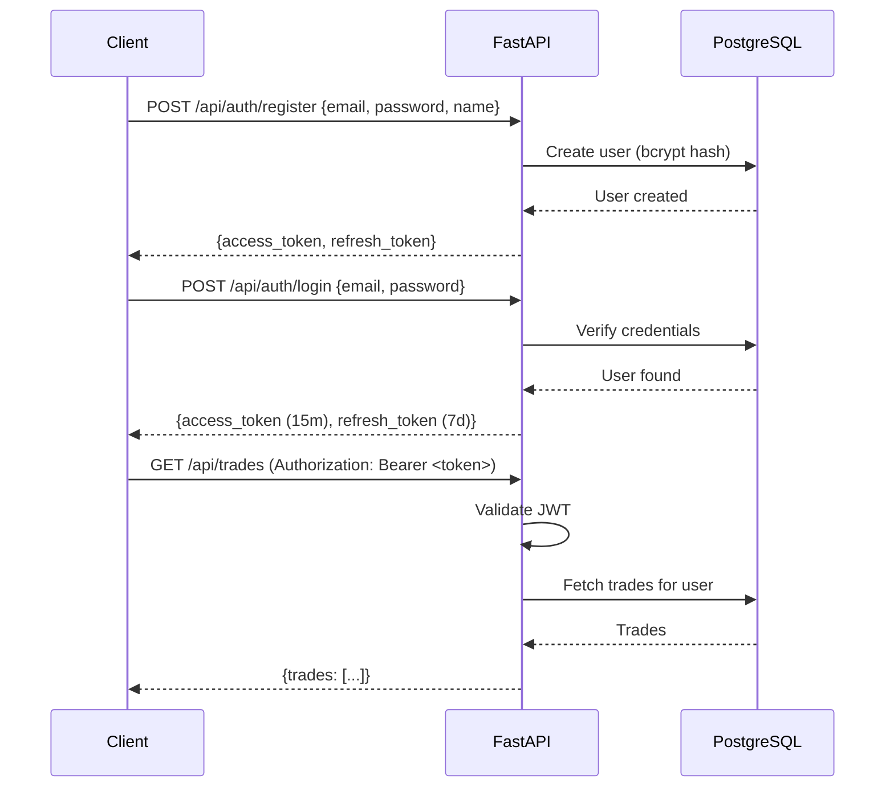

#### Error Response Format

```json
{
  "status": "error",
  "code": "RISK_LIMIT_EXCEEDED",
  "message": "Daily loss limit of 3% has been reached",
  "details": {
    "current_daily_loss": 3.2,
    "limit": 3.0
  },
  "timestamp": "2026-06-19T14:00:00Z"
}
```

---

## 3. Database ER Diagram

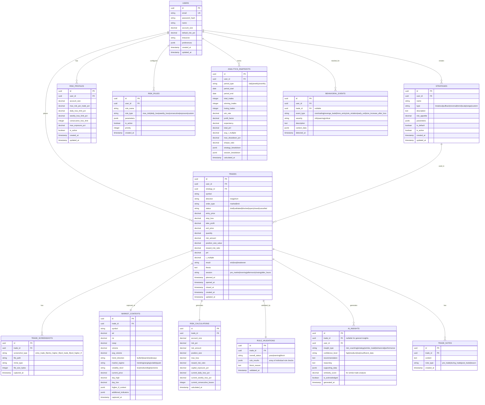

---

## 4. PostgreSQL Schema

> [!NOTE]
> The full schema will be managed by Alembic migrations. Below is the initial migration SQL that creates all tables.

```sql
-- Enable UUID extension
CREATE EXTENSION IF NOT EXISTS "uuid-ossp";

-- ============================================
-- USERS
-- ============================================
CREATE TABLE users (
    id              UUID PRIMARY KEY DEFAULT uuid_generate_v4(),
    email           VARCHAR(255) NOT NULL UNIQUE,
    password_hash   VARCHAR(255) NOT NULL,
    name            VARCHAR(100) NOT NULL,
    account_size    DECIMAL(15,2) NOT NULL DEFAULT 100000.00,
    default_risk_pct DECIMAL(5,2) NOT NULL DEFAULT 1.00,
    timezone        VARCHAR(50) DEFAULT 'Asia/Kolkata',
    preferences     JSONB DEFAULT '{}',
    is_active       BOOLEAN DEFAULT TRUE,
    created_at      TIMESTAMPTZ NOT NULL DEFAULT NOW(),
    updated_at      TIMESTAMPTZ NOT NULL DEFAULT NOW()
);

CREATE INDEX idx_users_email ON users(email);

-- ============================================
-- STRATEGIES
-- ============================================
CREATE TABLE strategies (
    id              UUID PRIMARY KEY DEFAULT uuid_generate_v4(),
    user_id         UUID NOT NULL REFERENCES users(id) ON DELETE CASCADE,
    name            VARCHAR(100) NOT NULL,
    type            VARCHAR(50) NOT NULL CHECK (type IN ('breakout','pullback','reversal','trend_following','scalping','range_trading','custom')),
    description     TEXT,
    risk_appetite   DECIMAL(5,2) DEFAULT 1.00,
    parameters      JSONB DEFAULT '{}',
    is_default      BOOLEAN DEFAULT FALSE,
    is_active       BOOLEAN DEFAULT TRUE,
    created_at      TIMESTAMPTZ NOT NULL DEFAULT NOW(),
    updated_at      TIMESTAMPTZ NOT NULL DEFAULT NOW(),
    UNIQUE(user_id, name)
);

CREATE INDEX idx_strategies_user ON strategies(user_id);
CREATE INDEX idx_strategies_type ON strategies(type);

-- ============================================
-- RISK PROFILES
-- ============================================
CREATE TABLE risk_profiles (
    id                          UUID PRIMARY KEY DEFAULT uuid_generate_v4(),
    user_id                     UUID NOT NULL REFERENCES users(id) ON DELETE CASCADE,
    account_size                DECIMAL(15,2) NOT NULL,
    max_risk_per_trade_pct      DECIMAL(5,2) NOT NULL DEFAULT 1.00,
    daily_loss_limit_pct        DECIMAL(5,2) NOT NULL DEFAULT 3.00,
    weekly_loss_limit_pct       DECIMAL(5,2) NOT NULL DEFAULT 7.00,
    consecutive_loss_limit      INTEGER NOT NULL DEFAULT 3,
    max_exposure_pct            DECIMAL(5,2) NOT NULL DEFAULT 10.00,
    is_active                   BOOLEAN DEFAULT TRUE,
    created_at                  TIMESTAMPTZ NOT NULL DEFAULT NOW(),
    updated_at                  TIMESTAMPTZ NOT NULL DEFAULT NOW()
);

CREATE INDEX idx_risk_profiles_user ON risk_profiles(user_id);

-- ============================================
-- RISK RULES
-- ============================================
CREATE TABLE risk_rules (
    id              UUID PRIMARY KEY DEFAULT uuid_generate_v4(),
    user_id         UUID NOT NULL REFERENCES users(id) ON DELETE CASCADE,
    rule_name       VARCHAR(100) NOT NULL,
    rule_type       VARCHAR(50) NOT NULL CHECK (rule_type IN ('max_risk','daily_loss','weekly_loss','consecutive','exposure','custom')),
    parameters      JSONB NOT NULL DEFAULT '{}',
    is_active       BOOLEAN DEFAULT TRUE,
    priority        INTEGER DEFAULT 0,
    created_at      TIMESTAMPTZ NOT NULL DEFAULT NOW()
);

CREATE INDEX idx_risk_rules_user ON risk_rules(user_id);

-- ============================================
-- TRADES
-- ============================================
CREATE TABLE trades (
    id                  UUID PRIMARY KEY DEFAULT uuid_generate_v4(),
    user_id             UUID NOT NULL REFERENCES users(id) ON DELETE CASCADE,
    strategy_id         UUID NOT NULL REFERENCES strategies(id),
    symbol              VARCHAR(50) NOT NULL,
    direction           VARCHAR(10) NOT NULL CHECK (direction IN ('long','short')),
    order_type          VARCHAR(10) NOT NULL DEFAULT 'market' CHECK (order_type IN ('market','limit')),
    status              VARCHAR(20) NOT NULL DEFAULT 'draft' CHECK (status IN ('draft','validated','blocked','open','closed','cancelled')),
    entry_price         DECIMAL(15,4) NOT NULL,
    stop_loss           DECIMAL(15,4) NOT NULL,
    take_profit         DECIMAL(15,4),
    exit_price          DECIMAL(15,4),
    quantity            DECIMAL(15,4),
    risk_amount         DECIMAL(15,2),
    position_size_value DECIMAL(15,2),
    reward_risk_ratio   DECIMAL(8,2),
    pnl                 DECIMAL(15,2),
    r_multiple          DECIMAL(8,2),
    result              VARCHAR(15) CHECK (result IN ('win','loss','breakeven')),
    thesis              TEXT,
    session             VARCHAR(20) CHECK (session IN ('pre_market','morning','afternoon','closing','after_hours')),
    planned_at          TIMESTAMPTZ,
    opened_at           TIMESTAMPTZ,
    closed_at           TIMESTAMPTZ,
    created_at          TIMESTAMPTZ NOT NULL DEFAULT NOW(),
    updated_at          TIMESTAMPTZ NOT NULL DEFAULT NOW()
);

CREATE INDEX idx_trades_user ON trades(user_id);
CREATE INDEX idx_trades_strategy ON trades(strategy_id);
CREATE INDEX idx_trades_status ON trades(status);
CREATE INDEX idx_trades_symbol ON trades(symbol);
CREATE INDEX idx_trades_result ON trades(result);
CREATE INDEX idx_trades_created ON trades(created_at DESC);
CREATE INDEX idx_trades_user_status ON trades(user_id, status);
CREATE INDEX idx_trades_user_created ON trades(user_id, created_at DESC);

-- ============================================
-- MARKET CONTEXTS
-- ============================================
CREATE TABLE market_contexts (
    id                      UUID PRIMARY KEY DEFAULT uuid_generate_v4(),
    trade_id                UUID NOT NULL UNIQUE REFERENCES trades(id) ON DELETE CASCADE,
    symbol                  VARCHAR(50) NOT NULL,
    atr                     DECIMAL(15,4),
    rsi                     DECIMAL(8,2),
    vwap                    DECIMAL(15,4),
    volume                  BIGINT,
    avg_volume              BIGINT,
    trend_direction         VARCHAR(20) CHECK (trend_direction IN ('bullish','bearish','sideways')),
    market_regime           VARCHAR(20) CHECK (market_regime IN ('trending','ranging','volatile','quiet')),
    volatility_level        VARCHAR(10) CHECK (volatility_level IN ('low','medium','high','extreme')),
    current_price           DECIMAL(15,4),
    day_high                DECIMAL(15,4),
    day_low                 DECIMAL(15,4),
    higher_tf_context       JSONB DEFAULT '{}',
    additional_indicators   JSONB DEFAULT '{}',
    captured_at             TIMESTAMPTZ NOT NULL DEFAULT NOW()
);

CREATE INDEX idx_market_ctx_trade ON market_contexts(trade_id);
CREATE INDEX idx_market_ctx_symbol ON market_contexts(symbol);

-- ============================================
-- RISK CALCULATIONS
-- ============================================
CREATE TABLE risk_calculations (
    id                          UUID PRIMARY KEY DEFAULT uuid_generate_v4(),
    trade_id                    UUID NOT NULL UNIQUE REFERENCES trades(id) ON DELETE CASCADE,
    account_size                DECIMAL(15,2) NOT NULL,
    risk_pct                    DECIMAL(5,2) NOT NULL,
    risk_amount                 DECIMAL(15,2) NOT NULL,
    position_size               DECIMAL(15,4) NOT NULL,
    max_loss                    DECIMAL(15,2) NOT NULL,
    reward_risk_ratio           DECIMAL(8,2),
    capital_exposure_pct        DECIMAL(5,2),
    current_daily_loss_pct      DECIMAL(5,2) DEFAULT 0.00,
    current_weekly_loss_pct     DECIMAL(5,2) DEFAULT 0.00,
    current_consecutive_losses  INTEGER DEFAULT 0,
    calculated_at               TIMESTAMPTZ NOT NULL DEFAULT NOW()
);

CREATE INDEX idx_risk_calc_trade ON risk_calculations(trade_id);

-- ============================================
-- RULE VALIDATIONS
-- ============================================
CREATE TABLE rule_validations (
    id                  UUID PRIMARY KEY DEFAULT uuid_generate_v4(),
    trade_id            UUID NOT NULL UNIQUE REFERENCES trades(id) ON DELETE CASCADE,
    overall_status      VARCHAR(10) NOT NULL CHECK (overall_status IN ('pass','warning','block')),
    rule_results        JSONB NOT NULL DEFAULT '[]',
    block_reason        TEXT,
    validated_at        TIMESTAMPTZ NOT NULL DEFAULT NOW()
);

CREATE INDEX idx_rule_val_trade ON rule_validations(trade_id);

-- ============================================
-- TRADE SCREENSHOTS
-- ============================================
CREATE TABLE trade_screenshots (
    id                  UUID PRIMARY KEY DEFAULT uuid_generate_v4(),
    trade_id            UUID NOT NULL REFERENCES trades(id) ON DELETE CASCADE,
    screenshot_type     VARCHAR(30) NOT NULL CHECK (screenshot_type IN ('entry_trade_tf','entry_higher_tf','exit_trade_tf','exit_higher_tf')),
    file_path           VARCHAR(500) NOT NULL,
    mime_type           VARCHAR(50) DEFAULT 'image/png',
    file_size_bytes     INTEGER,
    captured_at         TIMESTAMPTZ NOT NULL DEFAULT NOW()
);

CREATE INDEX idx_screenshots_trade ON trade_screenshots(trade_id);

-- ============================================
-- TRADE NOTES
-- ============================================
CREATE TABLE trade_notes (
    id              UUID PRIMARY KEY DEFAULT uuid_generate_v4(),
    trade_id        UUID NOT NULL REFERENCES trades(id) ON DELETE CASCADE,
    content         TEXT NOT NULL,
    note_type       VARCHAR(20) DEFAULT 'pre_trade' CHECK (note_type IN ('pre_trade','during_trade','post_trade','lesson')),
    created_at      TIMESTAMPTZ NOT NULL DEFAULT NOW()
);

CREATE INDEX idx_notes_trade ON trade_notes(trade_id);

-- ============================================
-- AI INSIGHTS
-- ============================================
CREATE TABLE ai_insights (
    id                  UUID PRIMARY KEY DEFAULT uuid_generate_v4(),
    trade_id            UUID REFERENCES trades(id) ON DELETE SET NULL,
    user_id             UUID NOT NULL REFERENCES users(id) ON DELETE CASCADE,
    insight_type        VARCHAR(30) NOT NULL CHECK (insight_type IN ('risk_coaching','strategy','similar_trade','behavioral','performance')),
    confidence_level    VARCHAR(20) NOT NULL CHECK (confidence_level IN ('high','medium','low','insufficient_data')),
    recommendation      TEXT NOT NULL,
    reasoning           TEXT NOT NULL,
    supporting_data     JSONB DEFAULT '{}',
    similarity_score    DECIMAL(5,2),
    is_acknowledged     BOOLEAN DEFAULT FALSE,
    generated_at        TIMESTAMPTZ NOT NULL DEFAULT NOW()
);

CREATE INDEX idx_ai_insights_user ON ai_insights(user_id);
CREATE INDEX idx_ai_insights_trade ON ai_insights(trade_id);
CREATE INDEX idx_ai_insights_type ON ai_insights(insight_type);

-- ============================================
-- BEHAVIORAL EVENTS
-- ============================================
CREATE TABLE behavioral_events (
    id              UUID PRIMARY KEY DEFAULT uuid_generate_v4(),
    user_id         UUID NOT NULL REFERENCES users(id) ON DELETE CASCADE,
    trade_id        UUID REFERENCES trades(id) ON DELETE SET NULL,
    event_type      VARCHAR(30) NOT NULL CHECK (event_type IN ('overtrading','revenge_trade','fomo_entry','rule_violation','early_exit','size_increase_after_loss')),
    severity        VARCHAR(10) NOT NULL DEFAULT 'warning' CHECK (severity IN ('info','warning','critical')),
    description     TEXT,
    context_data    JSONB DEFAULT '{}',
    detected_at     TIMESTAMPTZ NOT NULL DEFAULT NOW()
);

CREATE INDEX idx_behavioral_user ON behavioral_events(user_id);
CREATE INDEX idx_behavioral_type ON behavioral_events(event_type);

-- ============================================
-- ANALYTICS SNAPSHOTS
-- ============================================
CREATE TABLE analytics_snapshots (
    id                      UUID PRIMARY KEY DEFAULT uuid_generate_v4(),
    user_id                 UUID NOT NULL REFERENCES users(id) ON DELETE CASCADE,
    period_type             VARCHAR(10) NOT NULL CHECK (period_type IN ('daily','weekly','monthly')),
    period_start            DATE NOT NULL,
    period_end              DATE NOT NULL,
    total_trades            INTEGER DEFAULT 0,
    winning_trades          INTEGER DEFAULT 0,
    losing_trades           INTEGER DEFAULT 0,
    win_rate                DECIMAL(5,2),
    profit_factor           DECIMAL(8,2),
    expectancy              DECIMAL(15,2),
    total_pnl               DECIMAL(15,2),
    avg_r_multiple          DECIMAL(8,2),
    max_drawdown_pct        DECIMAL(5,2),
    sharpe_ratio            DECIMAL(8,4),
    strategy_breakdown      JSONB DEFAULT '{}',
    session_breakdown       JSONB DEFAULT '{}',
    calculated_at           TIMESTAMPTZ NOT NULL DEFAULT NOW(),
    UNIQUE(user_id, period_type, period_start)
);

CREATE INDEX idx_analytics_user ON analytics_snapshots(user_id);
CREATE INDEX idx_analytics_period ON analytics_snapshots(period_type, period_start);

-- ============================================
-- UPDATED_AT TRIGGER FUNCTION
-- ============================================
CREATE OR REPLACE FUNCTION update_updated_at_column()
RETURNS TRIGGER AS $$
BEGIN
    NEW.updated_at = NOW();
    RETURN NEW;
END;
$$ language 'plpgsql';

-- Apply trigger to tables with updated_at
CREATE TRIGGER update_users_updated_at BEFORE UPDATE ON users FOR EACH ROW EXECUTE FUNCTION update_updated_at_column();
CREATE TRIGGER update_strategies_updated_at BEFORE UPDATE ON strategies FOR EACH ROW EXECUTE FUNCTION update_updated_at_column();
CREATE TRIGGER update_risk_profiles_updated_at BEFORE UPDATE ON risk_profiles FOR EACH ROW EXECUTE FUNCTION update_updated_at_column();
CREATE TRIGGER update_trades_updated_at BEFORE UPDATE ON trades FOR EACH ROW EXECUTE FUNCTION update_updated_at_column();
```

---

## 5. FastAPI Folder Structure

```
backend/
├── alembic/                          # Database migrations
│   ├── versions/
│   ├── env.py
│   └── alembic.ini
├── app/
│   ├── __init__.py
│   ├── main.py                       # FastAPI app factory, middleware, startup
│   │
│   ├── core/                         # Cross-cutting concerns
│   │   ├── __init__.py
│   │   ├── config.py                 # Pydantic Settings (env vars)
│   │   ├── database.py               # SQLAlchemy engine, session factory
│   │   ├── security.py               # JWT encode/decode, password hashing
│   │   ├── dependencies.py           # FastAPI Depends (get_db, get_current_user)
│   │   ├── exceptions.py             # Custom exception classes
│   │   └── logging.py                # Structured logging setup
│   │
│   ├── models/                       # SQLAlchemy ORM models
│   │   ├── __init__.py
│   │   ├── user.py
│   │   ├── strategy.py
│   │   ├── trade.py
│   │   ├── risk_profile.py
│   │   ├── risk_rule.py
│   │   ├── market_context.py
│   │   ├── risk_calculation.py
│   │   ├── rule_validation.py
│   │   ├── trade_screenshot.py
│   │   ├── trade_note.py
│   │   ├── ai_insight.py
│   │   ├── behavioral_event.py
│   │   └── analytics_snapshot.py
│   │
│   ├── schemas/                      # Pydantic request/response models
│   │   ├── __init__.py
│   │   ├── auth.py
│   │   ├── user.py
│   │   ├── strategy.py
│   │   ├── trade.py
│   │   ├── risk.py
│   │   ├── market_context.py
│   │   ├── analytics.py
│   │   ├── ai.py
│   │   ├── screenshot.py
│   │   └── common.py                 # Shared schemas (pagination, errors)
│   │
│   ├── repositories/                 # Data access layer
│   │   ├── __init__.py
│   │   ├── user_repository.py
│   │   ├── strategy_repository.py
│   │   ├── trade_repository.py
│   │   ├── risk_repository.py
│   │   ├── market_context_repository.py
│   │   ├── analytics_repository.py
│   │   ├── ai_repository.py
│   │   └── behavioral_repository.py
│   │
│   ├── services/                     # Business logic layer
│   │   ├── __init__.py
│   │   ├── auth_service.py
│   │   ├── strategy_service.py
│   │   ├── trade_service.py
│   │   ├── risk_engine.py            # Position sizing, risk calculations
│   │   ├── rule_engine.py            # Trade validation against rules
│   │   ├── market_context_service.py
│   │   ├── analytics_engine.py       # Statistical calculations
│   │   ├── ai_service.py             # AI orchestration layer
│   │   ├── screenshot_service.py
│   │   └── behavioral_service.py     # Behavioral pattern detection
│   │
│   ├── api/                          # API route handlers
│   │   ├── __init__.py
│   │   ├── router.py                 # Main router aggregator
│   │   ├── auth/
│   │   │   ├── __init__.py
│   │   │   └── routes.py
│   │   ├── strategies/
│   │   │   ├── __init__.py
│   │   │   └── routes.py
│   │   ├── trades/
│   │   │   ├── __init__.py
│   │   │   └── routes.py
│   │   ├── risk/
│   │   │   ├── __init__.py
│   │   │   └── routes.py
│   │   ├── analytics/
│   │   │   ├── __init__.py
│   │   │   └── routes.py
│   │   ├── market_context/
│   │   │   ├── __init__.py
│   │   │   └── routes.py
│   │   ├── ai/
│   │   │   ├── __init__.py
│   │   │   └── routes.py
│   │   └── screenshots/
│   │       ├── __init__.py
│   │       └── routes.py
│   │
│   └── ai/                           # AI-specific module
│       ├── __init__.py
│       ├── feature_extractor.py      # Converts analytics → AI features
│       ├── similarity_engine.py      # Similar trade matching
│       ├── behavioral_detector.py    # Pattern detection algorithms
│       ├── prompt_templates.py       # LLM prompt templates
│       └── llm_client.py            # LLM API client (OpenAI/local)
│
├── tests/
│   ├── conftest.py
│   ├── test_auth/
│   ├── test_trades/
│   ├── test_risk_engine/
│   ├── test_rule_engine/
│   ├── test_analytics/
│   └── test_ai/
│
├── screenshots/                      # Local screenshot storage (MVP)
├── .env.example
├── docker-compose.yml
├── Dockerfile
├── requirements.txt
└── pyproject.toml
```

---

## 6. API Specifications

### 6.1 Authentication — `/api/auth`

| Method | Endpoint | Description | Auth |
|---|---|---|---|
| POST | `/api/auth/register` | Create new user account | ❌ |
| POST | `/api/auth/login` | Login, returns JWT tokens | ❌ |
| POST | `/api/auth/refresh` | Refresh access token | 🔑 Refresh |
| POST | `/api/auth/logout` | Invalidate refresh token | 🔑 |
| GET | `/api/auth/me` | Get current user profile | 🔑 |
| PATCH | `/api/auth/me` | Update profile & settings | 🔑 |

#### POST `/api/auth/register`

```json
// Request
{
  "email": "trader@example.com",
  "password": "SecurePassword123!",
  "name": "John Trader",
  "account_size": 500000.00,
  "default_risk_pct": 1.00,
  "timezone": "Asia/Kolkata"
}

// Response 201
{
  "status": "success",
  "data": {
    "user": { "id": "uuid", "email": "...", "name": "..." },
    "access_token": "eyJ...",
    "refresh_token": "eyJ...",
    "token_type": "bearer"
  }
}
```

---

### 6.2 Strategies — `/api/strategies`

| Method | Endpoint | Description | Auth |
|---|---|---|---|
| GET | `/api/strategies` | List user's strategies | 🔑 |
| POST | `/api/strategies` | Create new strategy | 🔑 |
| GET | `/api/strategies/{id}` | Get strategy details | 🔑 |
| PATCH | `/api/strategies/{id}` | Update strategy | 🔑 |
| DELETE | `/api/strategies/{id}` | Soft delete strategy | 🔑 |
| POST | `/api/strategies/seed-defaults` | Create default strategies | 🔑 |

#### POST `/api/strategies`

```json
// Request
{
  "name": "Morning Breakout",
  "type": "breakout",
  "description": "Breakout trades on high volume during morning session",
  "risk_appetite": 1.5,
  "parameters": {
    "preferred_session": "morning",
    "min_volume_multiplier": 1.5,
    "confirmation_required": true
  }
}

// Response 201
{
  "status": "success",
  "data": {
    "id": "uuid",
    "name": "Morning Breakout",
    "type": "breakout",
    "description": "...",
    "risk_appetite": 1.5,
    "parameters": {...},
    "is_active": true,
    "created_at": "2026-06-19T14:00:00Z"
  }
}
```

---

### 6.3 Trades — `/api/trades`

| Method | Endpoint | Description | Auth |
|---|---|---|---|
| GET | `/api/trades` | List trades (paginated, filtered) | 🔑 |
| POST | `/api/trades` | Create trade (Draft → auto Risk+Rule) | 🔑 |
| GET | `/api/trades/{id}` | Get trade with all relations | 🔑 |
| PATCH | `/api/trades/{id}` | Update trade details | 🔑 |
| POST | `/api/trades/{id}/open` | Transition: Validated → Open | 🔑 |
| POST | `/api/trades/{id}/close` | Close trade with exit data | 🔑 |
| POST | `/api/trades/{id}/cancel` | Cancel trade | 🔑 |
| GET | `/api/trades/{id}/risk` | Get risk calculations | 🔑 |
| GET | `/api/trades/{id}/rules` | Get rule validation results | 🔑 |
| GET | `/api/trades/{id}/context` | Get market context | 🔑 |
| GET | `/api/trades/{id}/screenshots` | Get trade screenshots | 🔑 |
| POST | `/api/trades/{id}/screenshots` | Upload screenshot | 🔑 |

#### POST `/api/trades` — Full Trade Creation Flow

```json
// Request — User provides minimal input
{
  "strategy_id": "uuid",
  "symbol": "NIFTY",
  "direction": "long",
  "entry_price": 24500.00,
  "stop_loss": 24400.00,
  "take_profit": 24700.00,
  "order_type": "limit",
  "thesis": "Breaking above resistance with volume confirmation"
}

// Response 201 — System auto-calculates everything
{
  "status": "success",
  "data": {
    "trade": {
      "id": "uuid",
      "symbol": "NIFTY",
      "direction": "long",
      "status": "validated",
      "entry_price": 24500.00,
      "stop_loss": 24400.00,
      "take_profit": 24700.00,
      "quantity": 5,
      "risk_amount": 500.00,
      "position_size_value": 122500.00,
      "reward_risk_ratio": 2.00,
      "session": "morning"
    },
    "risk_calculation": {
      "account_size": 500000.00,
      "risk_pct": 1.00,
      "risk_amount": 5000.00,
      "position_size": 50,
      "max_loss": 5000.00,
      "reward_risk_ratio": 2.00,
      "capital_exposure_pct": 24.50,
      "current_daily_loss_pct": 0.50,
      "current_weekly_loss_pct": 1.20
    },
    "rule_validation": {
      "overall_status": "pass",
      "rule_results": [
        {"rule": "max_risk_per_trade", "status": "pass", "message": "Risk 1.00% within 2.00% limit"},
        {"rule": "daily_loss_limit", "status": "pass", "message": "Daily loss 0.50% within 3.00% limit"},
        {"rule": "weekly_loss_limit", "status": "pass", "message": "Weekly loss 1.20% within 7.00% limit"},
        {"rule": "consecutive_loss", "status": "warning", "message": "2 consecutive losses (limit: 3)"}
      ]
    },
    "market_context": {
      "atr": 150.25,
      "rsi": 62.4,
      "vwap": 24480.00,
      "volume": 15000000,
      "trend_direction": "bullish",
      "market_regime": "trending",
      "volatility_level": "medium"
    }
  }
}
```

#### POST `/api/trades/{id}/close`

```json
// Request
{
  "exit_price": 24680.00,
  "notes": "Exited near target, slight pullback"
}

// Response 200
{
  "status": "success",
  "data": {
    "trade": {
      "status": "closed",
      "exit_price": 24680.00,
      "pnl": 9000.00,
      "r_multiple": 1.80,
      "result": "win"
    },
    "analytics_updated": true,
    "ai_insight": {
      "insight_type": "performance",
      "recommendation": "Excellent trade execution. Similar breakout setups in morning sessions have 67% win rate across 23 trades.",
      "confidence_level": "high"
    }
  }
}
```

---

### 6.4 Risk Engine — `/api/risk`

| Method | Endpoint | Description | Auth |
|---|---|---|---|
| POST | `/api/risk/calculate` | Calculate position size for inputs | 🔑 |
| GET | `/api/risk/profile` | Get user's risk profile | 🔑 |
| PATCH | `/api/risk/profile` | Update risk profile | 🔑 |
| GET | `/api/risk/exposure` | Get current risk exposure | 🔑 |
| GET | `/api/risk/rules` | List active risk rules | 🔑 |
| POST | `/api/risk/rules` | Create custom risk rule | 🔑 |
| PATCH | `/api/risk/rules/{id}` | Update risk rule | 🔑 |
| DELETE | `/api/risk/rules/{id}` | Disable risk rule | 🔑 |

#### POST `/api/risk/calculate`

```json
// Request
{
  "symbol": "RELIANCE",
  "entry_price": 2800.00,
  "stop_loss": 2750.00,
  "take_profit": 2900.00,
  "direction": "long"
}

// Response 200
{
  "status": "success",
  "data": {
    "account_size": 500000.00,
    "risk_pct": 1.00,
    "risk_amount": 5000.00,
    "risk_per_unit": 50.00,
    "position_size": 100,
    "position_value": 280000.00,
    "max_loss": 5000.00,
    "potential_profit": 10000.00,
    "reward_risk_ratio": 2.00,
    "capital_exposure_pct": 56.00,
    "current_daily_loss_pct": 0.00,
    "current_weekly_loss_pct": 0.00,
    "current_consecutive_losses": 0
  }
}
```

---

### 6.5 Analytics — `/api/analytics`

| Method | Endpoint | Description | Auth |
|---|---|---|---|
| GET | `/api/analytics/overview` | Dashboard KPIs | 🔑 |
| GET | `/api/analytics/equity-curve` | Equity curve data points | 🔑 |
| GET | `/api/analytics/performance` | Performance by period | 🔑 |
| GET | `/api/analytics/strategies` | Strategy breakdown | 🔑 |
| GET | `/api/analytics/sessions` | Session breakdown | 🔑 |
| GET | `/api/analytics/drawdown` | Drawdown series | 🔑 |

#### GET `/api/analytics/overview`

```json
// Response 200
{
  "status": "success",
  "data": {
    "account_balance": 525000.00,
    "total_pnl": 25000.00,
    "total_pnl_pct": 5.00,
    "today_pnl": 3500.00,
    "total_trades": 87,
    "win_rate": 58.62,
    "profit_factor": 1.85,
    "expectancy": 287.36,
    "avg_r_multiple": 0.95,
    "max_drawdown_pct": 4.20,
    "current_drawdown_pct": 1.10,
    "best_strategy": "Breakout",
    "worst_strategy": "Reversal",
    "current_streak": 3,
    "streak_type": "winning",
    "open_trades": 2,
    "risk_exposure_pct": 2.30,
    "daily_loss_pct": 0.00,
    "weekly_loss_pct": 0.80
  }
}
```

---

### 6.6 AI — `/api/ai`

| Method | Endpoint | Description | Auth |
|---|---|---|---|
| POST | `/api/ai/trade-analysis` | Analyze trade before execution | 🔑 |
| POST | `/api/ai/similar-trades` | Find similar historical trades | 🔑 |
| GET | `/api/ai/coaching` | Get behavioral coaching insights | 🔑 |
| GET | `/api/ai/strategy-intelligence` | Strategy performance analysis | 🔑 |
| GET | `/api/ai/alerts` | Get active AI alerts | 🔑 |
| POST | `/api/ai/insights/{id}/acknowledge` | Mark insight as acknowledged | 🔑 |

#### POST `/api/ai/similar-trades`

```json
// Request
{
  "strategy_id": "uuid",
  "symbol": "NIFTY",
  "direction": "long",
  "entry_price": 24500.00,
  "stop_loss": 24400.00,
  "market_context": {
    "trend_direction": "bullish",
    "volatility_level": "medium",
    "session": "morning"
  }
}

// Response 200
{
  "status": "success",
  "data": {
    "confidence_level": "high",
    "total_similar_trades": 23,
    "similarity_criteria": ["strategy", "direction", "session", "trend", "volatility"],
    "historical_win_rate": 67.0,
    "historical_avg_r": 1.24,
    "historical_profit_factor": 2.1,
    "recommendation": "take_trade",
    "reasoning": "Similar breakout setups in morning sessions with bullish trend and medium volatility have achieved a 67% win rate across 23 historical trades with an average R-multiple of 1.24.",
    "similar_trades": [
      {
        "trade_id": "uuid",
        "symbol": "NIFTY",
        "date": "2026-05-15",
        "result": "win",
        "r_multiple": 2.10,
        "similarity_score": 0.92
      }
    ]
  }
}
```

---

### 6.7 Market Context — `/api/market-context`

| Method | Endpoint | Description | Auth |
|---|---|---|---|
| GET | `/api/market-context/{trade_id}` | Get market context for trade | 🔑 |
| POST | `/api/market-context/capture` | Manually capture context | 🔑 |

---

### 6.8 Screenshots — `/api/screenshots`

| Method | Endpoint | Description | Auth |
|---|---|---|---|
| POST | `/api/trades/{id}/screenshots` | Upload screenshot | 🔑 |
| GET | `/api/trades/{id}/screenshots` | List trade screenshots | 🔑 |
| GET | `/api/screenshots/{id}/file` | Download screenshot file | 🔑 |
| DELETE | `/api/screenshots/{id}` | Delete screenshot | 🔑 |

---

## 7. Frontend Information Architecture

### 7.1 Page Structure & Navigation

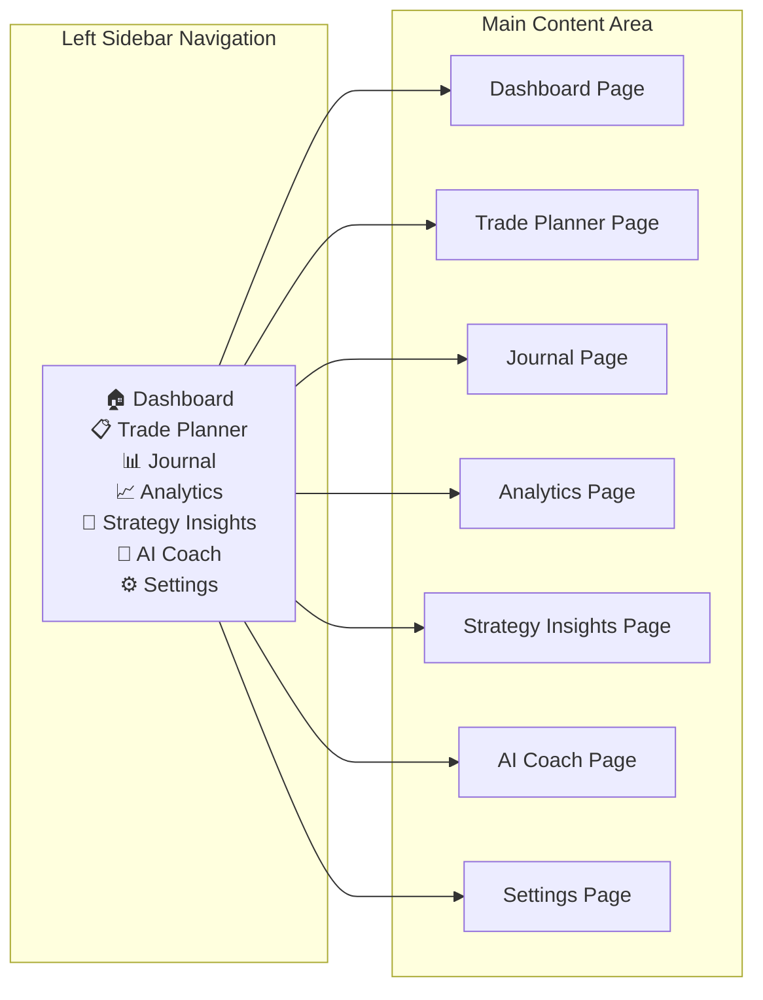

### 7.2 Frontend Directory Structure

```
frontend/
├── app/                              # Next.js App Router
│   ├── layout.tsx                    # Root layout (sidebar, theme)
│   ├── page.tsx                      # Dashboard (default route)
│   ├── (auth)/
│   │   ├── login/page.tsx
│   │   └── register/page.tsx
│   ├── trade-planner/page.tsx
│   ├── journal/
│   │   ├── page.tsx
│   │   └── [id]/page.tsx             # Trade review detail
│   ├── analytics/page.tsx
│   ├── strategy-insights/page.tsx
│   ├── ai-coach/page.tsx
│   └── settings/page.tsx
│
├── components/
│   ├── layout/
│   │   ├── Sidebar.tsx
│   │   ├── Header.tsx
│   │   ├── RiskBar.tsx               # Global risk status bar
│   │   └── MainLayout.tsx
│   ├── ui/                           # shadcn/ui components
│   ├── dashboard/
│   │   ├── KPICards.tsx
│   │   ├── EquityCurve.tsx
│   │   ├── WinRateTrend.tsx
│   │   ├── RecentTrades.tsx
│   │   ├── AIAlerts.tsx
│   │   └── WeeklyPerformance.tsx
│   ├── trade-planner/
│   │   ├── StrategySelector.tsx
│   │   ├── TradeForm.tsx
│   │   ├── RiskPanel.tsx
│   │   ├── RuleValidation.tsx
│   │   └── AIRecommendation.tsx
│   ├── journal/
│   │   ├── TradeTable.tsx
│   │   ├── TradeFilters.tsx
│   │   └── TradeDetail.tsx
│   ├── analytics/
│   │   ├── PerformanceCards.tsx
│   │   ├── StrategyChart.tsx
│   │   ├── DrawdownChart.tsx
│   │   └── SessionHeatmap.tsx
│   ├── strategy-insights/
│   │   ├── StrategyScorecard.tsx
│   │   └── ConditionMatrix.tsx
│   ├── ai-coach/
│   │   ├── CoachingCard.tsx
│   │   ├── BehavioralTimeline.tsx
│   │   └── InsightFeed.tsx
│   └── shared/
│       ├── RiskBadge.tsx
│       ├── StatusBadge.tsx
│       ├── ConfidenceLevel.tsx
│       └── EmptyState.tsx
│
├── lib/
│   ├── api/                          # API client functions
│   │   ├── client.ts                 # Axios instance with interceptors
│   │   ├── auth.ts
│   │   ├── trades.ts
│   │   ├── strategies.ts
│   │   ├── risk.ts
│   │   ├── analytics.ts
│   │   └── ai.ts
│   ├── hooks/
│   │   ├── useAuth.ts
│   │   ├── useTrades.ts
│   │   ├── useRisk.ts
│   │   ├── useAnalytics.ts
│   │   └── useAI.ts
│   └── utils/
│       ├── formatters.ts             # Currency, percentage, date formatting
│       ├── calculations.ts           # Client-side preview calculations
│       └── constants.ts
│
├── stores/                           # Zustand state stores
│   ├── authStore.ts
│   ├── tradeStore.ts
│   └── uiStore.ts
│
├── types/
│   ├── trade.ts
│   ├── strategy.ts
│   ├── risk.ts
│   ├── analytics.ts
│   ├── ai.ts
│   └── api.ts
│
├── styles/
│   └── globals.css
│
├── tailwind.config.ts
├── next.config.ts
├── tsconfig.json
└── package.json
```

---

## 8. Wireframes

### 8.1 Dashboard Layout

```
┌──────────────────────────────────────────────────────────────────────────────┐
│ ┌──────┐  ┌──────────────────────────────────────────────────┐ ┌──────────┐ │
│ │      │  │ 💰 Account Balance  📊 Today's PnL  🎯 Win Rate│ │ AI ALERTS│ │
│ │  S   │  │   ₹5,25,000         +₹3,500          58.6%     │ │          │ │
│ │  I   │  │ 📉 Drawdown        ⚡ Risk Exposure  🏆 Score  │ │ ⚠️ Reduce│ │
│ │  D   │  │   -1.10%            2.30%             82/100   │ │   size   │ │
│ │  E   │  ├──────────────────────────────────────┤          │ │          │ │
│ │  B   │  │                                      │          │ │ 💡 Avoid │ │
│ │  A   │  │     📈 EQUITY CURVE CHART            │          │ │   PM     │ │
│ │  R   │  │                                      │          │ │   setups │ │
│ │      │  │                                      │          │ │          │ │
│ │ ───  │  ├────────────────────┬─────────────────┤          │ │ 📊 Best  │ │
│ │ 🏠   │  │ Win Rate Trend     │Weekly Perf Chart│          │ │ strategy │ │
│ │ 📋   │  │                    │                 │          │ │ this wk: │ │
│ │ 📊   │  │                    │                 │          │ │ Breakout │ │
│ │ 📈   │  ├────────────────────┴─────────────────┤          │ │          │ │
│ │ 🧠   │  │ RECENT TRADES                        │          │ │          │ │
│ │ 🤖   │  │ ┌─────┬──────┬─────┬─────┬────────┐ │          │ │          │ │
│ │ ⚙️   │  │ │Date │Strat │Sym  │PnL  │Result  │ │          │ │          │ │
│ │      │  │ │06/19│Break │NIFTY│+3500│✅ Win  │ │          │ │          │ │
│ │      │  │ │06/18│Pull  │BANK │-1200│❌ Loss │ │          │ │          │ │
│ └──────┘  └──────────────────────────────────────┘ └──────────┘          │ │
└──────────────────────────────────────────────────────────────────────────────┘
```

### 8.2 Trade Planner Layout (Most Important Screen)

```
┌──────────────────────────────────────────────────────────────────────────────┐
│ ┌──────┐  ┌────────────┐ ┌────────────────────┐ ┌──────────────────────────┐│
│ │      │  │ STRATEGY   │ │   TRADE DETAILS    │ │    RISK ANALYSIS         ││
│ │  S   │  │            │ │                    │ │                          ││
│ │  I   │  │ [Breakout▾]│ │ Symbol: NIFTY      │ │ 💰 Risk Amount           ││
│ │  D   │  │            │ │ Direction: LONG    │ │    ₹5,000 (1.00%)       ││
│ │  E   │  │ Order Type │ │                    │ │                          ││
│ │  B   │  │ ○ Market   │ │ Entry:  24,500.00  │ │ 📦 Position Size         ││
│ │  A   │  │ ● Limit    │ │ SL:     24,400.00  │ │    50 units              ││
│ │  R   │  │            │ │ TP:     24,700.00  │ │                          ││
│ │      │  │ ───────    │ │                    │ │ 🎯 RR Ratio              ││
│ │      │  │ Notes:     │ │ Qty:    50         │ │    1 : 2.00              ││
│ │      │  │ [Breaking  │ │ Value:  ₹12,25,000 │ │                          ││
│ │      │  │  above     │ │                    │ │ 📉 Max Loss              ││
│ │      │  │  resistance│ │                    │ │    ₹5,000                ││
│ │      │  │  with vol] │ │                    │ │                          ││
│ │      │  │            │ │                    │ │ ⚡ Capital Exposure       ││
│ │      │  │            │ │                    │ │    24.5%                 ││
│ │      │  │            │ │                    │ │ ─────────────────────    ││
│ │      │  │            │ │                    │ │ RULE VALIDATION          ││
│ │      │  │            │ │                    │ │ ✅ Max Risk:    PASS     ││
│ │      │  │            │ │                    │ │ ✅ Daily Loss:  PASS     ││
│ │      │  │            │ │                    │ │ ✅ Weekly Loss: PASS     ││
│ │      │  │            │ │                    │ │ ⚠️ Consec Loss: WARNING  ││
│ │      │  ├────────────┴─┴────────────────────┴─┴──────────────────────────┤│
│ │      │  │ AI RECOMMENDATION                                              ││
│ │      │  │ 🟢 TAKE TRADE — Historical Similarity: 82% | Win Rate: 67%    ││
│ │      │  │ Similar breakout setups in morning sessions with bullish trend  ││
│ │      │  │ achieved 67% win rate across 23 trades (Avg R: 1.24)           ││
│ └──────┘  └────────────────────────────────────────────────────────────────┘│
│           │          [Cancel]                    [Confirm & Open Trade] ▶   ││
└──────────────────────────────────────────────────────────────────────────────┘
```

### 8.3 Journal Layout

```
┌──────────────────────────────────────────────────────────────────────────────┐
│ ┌──────┐  ┌─────────────────────────────────────────────────────────────────┐│
│ │      │  │ FILTERS: [Strategy▾] [Symbol▾] [Date Range] [Win/Loss▾] [Sess]││
│ │  S   │  ├─────┬──────────┬──────┬───────┬────────┬──────┬───────┬───────┤│
│ │  I   │  │Date │Strategy  │Symbol│Risk   │Result  │PnL   │R Mult │Notes  ││
│ │  D   │  ├─────┼──────────┼──────┼───────┼────────┼──────┼───────┼───────┤│
│ │  E   │  │06/19│Breakout  │NIFTY │1.00%  │✅ Win  │+3500 │+1.80  │Break..││
│ │  B   │  │06/18│Pullback  │BANK  │1.00%  │❌ Loss │-1200 │-0.60  │Pull..│ │
│ │  A   │  │06/17│Breakout  │TCS   │0.75%  │✅ Win  │+2800 │+2.10  │Morn..││
│ │  R   │  │06/16│Reversal  │NIFTY │1.50%  │❌ Loss │-3750 │-1.00  │Fals..││
│ │      │  │06/15│Trend     │RELI  │1.00%  │✅ Win  │+4200 │+1.40  │Stro..││
│ │      │  │...  │...       │...   │...    │...     │...   │...    │...   ││
│ └──────┘  └─────┴──────────┴──────┴───────┴────────┴──────┴───────┴───────┘│
│           │                   ◀ Page 1 of 5 ▶                              ││
└──────────────────────────────────────────────────────────────────────────────┘
```

### 8.4 AI Coach Layout

```
┌──────────────────────────────────────────────────────────────────────────────┐
│ ┌──────┐  ┌─────────────────┐ ┌────────────────────────────────────────────┐│
│ │      │  │ COACHING TABS   │ │                                            ││
│ │  S   │  │ [Risk] [Behav]  │ │ 🧠 AI COACHING — Risk Management          ││
│ │  I   │  │ [Strat] [Perf]  │ │                                            ││
│ │  D   │  ├─────────────────┤ │ ⚠️ HIGH CONFIDENCE                        ││
│ │  E   │  │                 │ │ You tend to increase position size after   ││
│ │  B   │  │ Insight Feed:   │ │ losing trades. Over the last 30 trades,   ││
│ │  A   │  │                 │ │ your average risk increases by 0.3% after ││
│ │  R   │  │ 📊 Risk tends   │ │ a loss. This has resulted in 40% larger   ││
│ │      │  │ to increase     │ │ losses on revenge trades.                 ││
│ │      │  │ after losses    │ │                                            ││
│ │      │  │                 │ │ Recommendation: Lock risk at 1.0% for the ││
│ │      │  │ 🕐 Best trading │ │ next 5 trades after any loss.             ││
│ │      │  │ window: 9:30-   │ │                                            ││
│ │      │  │ 11:00 AM        │ │ Supporting Data:                           ││
│ │      │  │                 │ │ ┌───────────┬────────┬──────────┐          ││
│ │      │  │ 🎯 Breakout     │ │ │Post-Loss  │Trades  │Avg Loss  │          ││
│ │      │  │ win rate drops  │ │ │Normal Risk│18      │-₹1,200   │          ││
│ │      │  │ on Fridays      │ │ │+Risk      │12      │-₹2,100   │          ││
│ │      │  │                 │ │ └───────────┴────────┴──────────┘          ││
│ └──────┘  └─────────────────┘ └────────────────────────────────────────────┘│
└──────────────────────────────────────────────────────────────────────────────┘
```

---

## 9. User Flows

### 9.1 Trade Creation Flow (Primary)

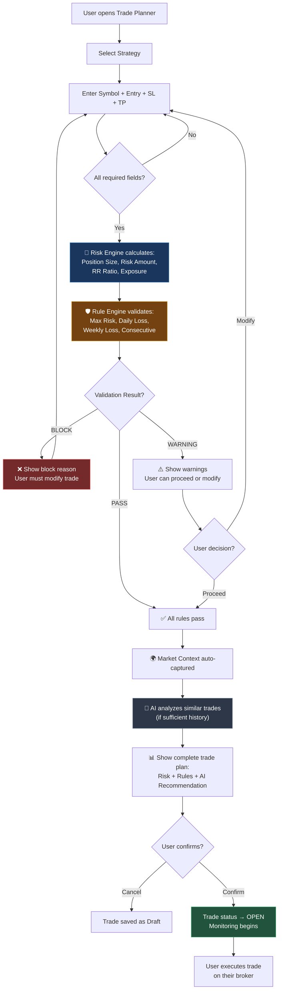

### 9.2 Trade Closure Flow

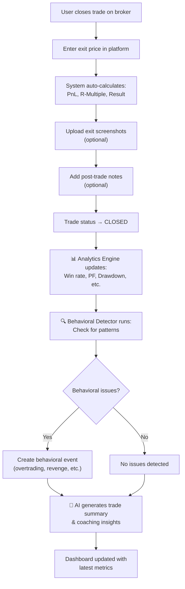

### 9.3 Registration & Onboarding Flow

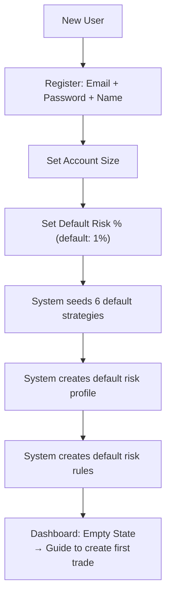

---

## 10. AI Architecture Design

### 10.1 AI Pipeline Architecture

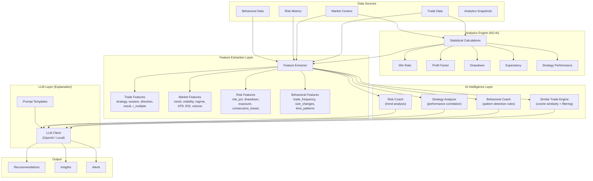

### 10.2 AI Capability Matrix

| Capability | Input | Processing | Output | Phase |
|---|---|---|---|---|
| **Risk Coaching** | Risk metrics, drawdown trends, position sizing history | Detect escalating risk patterns, compare to safe baselines | "Reduce position size" / "Current drawdown exceeds historical avg" | Phase 10 |
| **Similar Trade Analysis** | Current trade params + market context | Cosine similarity on feature vectors against historical trades | Similarity score, historical win rate, confidence level | Phase 11 |
| **Behavioral Coaching** | Trade timestamps, sizes, results, rule validation history | Rule-based pattern detection (overtrading = >N trades/day, revenge = loss → immediate large trade) | Behavioral alerts, coaching recommendations | Phase 12 |
| **Strategy Intelligence** | Trade history grouped by strategy + market context | Correlation analysis: strategy × session × market_regime → outcomes | Strategy scorecards, best/worst conditions | Phase 13 |

### 10.3 Similar Trade Engine — Algorithm

```python
# Pseudocode for similar trade matching
def find_similar_trades(current_trade, historical_trades, min_trades=7):
    """
    Step 1: Filter by hard constraints
    Step 2: Compute similarity scores
    Step 3: Aggregate outcomes
    Step 4: Generate confidence level
    """
    
    # Step 1: Hard filters
    filtered = [t for t in historical_trades 
                if t.strategy_type == current_trade.strategy_type
                and t.direction == current_trade.direction
                and t.status == 'closed']
    
    if len(filtered) < min_trades:
        return InsufficientDataResponse()
    
    # Step 2: Soft similarity (weighted features)
    features = {
        'session': 0.20,           # Same trading session
        'trend_direction': 0.25,   # Same market trend
        'volatility_level': 0.15,  # Similar volatility
        'market_regime': 0.20,     # Same market regime
        'rsi_bucket': 0.10,        # Similar RSI range
        'atr_bucket': 0.10,        # Similar ATR range
    }
    
    scored = []
    for trade in filtered:
        score = sum(
            weight for feature, weight in features.items()
            if match(current_trade, trade, feature)
        )
        scored.append((trade, score))
    
    # Step 3: Top N similar trades (score > 0.5)
    similar = [(t, s) for t, s in scored if s >= 0.5]
    similar.sort(key=lambda x: x[1], reverse=True)
    
    # Step 4: Aggregate outcomes
    wins = sum(1 for t, _ in similar if t.result == 'win')
    win_rate = wins / len(similar) * 100
    avg_r = mean(t.r_multiple for t, _ in similar)
    
    # Step 5: Confidence level
    confidence = determine_confidence(len(similar), max(s for _, s in similar))
    
    return SimilarTradeResult(
        total=len(similar),
        win_rate=win_rate,
        avg_r=avg_r,
        confidence=confidence,
        recommendation=derive_recommendation(win_rate, avg_r, confidence)
    )
```

### 10.4 Behavioral Detection Rules

| Behavior | Detection Logic | Severity |
|---|---|---|
| **Overtrading** | > 5 trades in single session, or > 8 trades in a day | Warning / Critical |
| **Revenge Trading** | Trade opened within 10 min of a loss, with increased size | Critical |
| **FOMO Entry** | Trade outside preferred session, against trend, with no thesis | Warning |
| **Rule Violation** | Trade opened despite BLOCK status from Rule Engine | Critical |
| **Early Exit** | Exit before TP with profit < 0.5R, and price continued to TP | Info |
| **Size Increase After Loss** | Position size > 120% of average after a losing trade | Warning |

### 10.5 AI Data Sufficiency Policy

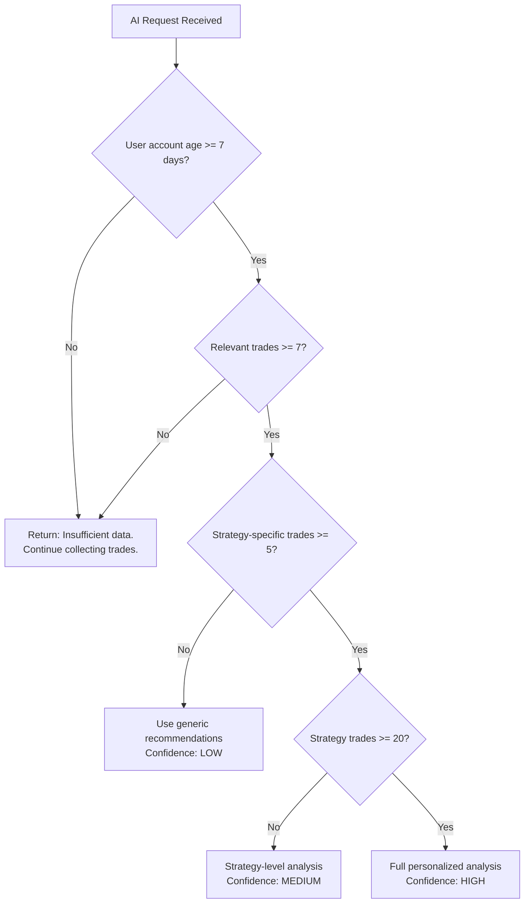

### 10.6 LLM Integration Strategy

| Aspect | MVP Approach | Future |
|---|---|---|
| **Provider** | OpenAI GPT-4o-mini (cost-effective) | Fine-tuned model or local LLM |
| **Usage** | Explanation & narrative generation only | Pattern recognition, chart analysis |
| **Caching** | Cache identical insight requests for 1 hour | Semantic caching |
| **Fallback** | Template-based responses if LLM unavailable | Multiple provider failover |
| **Rate Limit** | Max 10 AI requests per user per hour | Dynamic based on subscription |

---

## 11. Development Milestones

> [!IMPORTANT]
> Each phase must be completed, tested, and approved before the next phase begins. This order is **non-negotiable** per the product requirements.

### Phase 0 — Foundation (Week 1-2)

| # | Task | Type | Estimated Effort |
|---|---|---|---|
| 0.1 | FastAPI project scaffolding + folder structure | Backend | 2h |
| 0.2 | PostgreSQL + Docker Compose setup | Infra | 2h |
| 0.3 | SQLAlchemy 2.0 async engine + session factory | Backend | 3h |
| 0.4 | Alembic migration setup | Backend | 2h |
| 0.5 | Pydantic Settings (config management) | Backend | 1h |
| 0.6 | Global exception handling + error schemas | Backend | 2h |
| 0.7 | Structured logging (structlog) | Backend | 1h |
| 0.8 | Next.js 15 project setup (App Router + TS) | Frontend | 2h |
| 0.9 | TailwindCSS 4 + shadcn/ui setup | Frontend | 2h |
| 0.10 | Design system: colors, typography, spacing tokens | Frontend | 3h |
| 0.11 | Layout shell: Sidebar + Main content area | Frontend | 4h |
| 0.12 | API client setup (Axios + interceptors) | Frontend | 2h |
| | **Total** | | **~26h** |

**Success Criteria:** Project runs locally. Frontend renders layout. Backend serves health check.

---

### Phase 1 — Authentication (Week 2-3)

| # | Task | Type | Estimated Effort |
|---|---|---|---|
| 1.1 | User model + migration | Backend | 2h |
| 1.2 | Auth schemas (register, login, token) | Backend | 2h |
| 1.3 | Security module (JWT + bcrypt) | Backend | 3h |
| 1.4 | Auth service (register, login, refresh) | Backend | 4h |
| 1.5 | Auth routes + dependency injection | Backend | 3h |
| 1.6 | Login page | Frontend | 4h |
| 1.7 | Register page | Frontend | 3h |
| 1.8 | Auth state management (Zustand) | Frontend | 3h |
| 1.9 | Protected route middleware | Frontend | 2h |
| 1.10 | Auth API integration tests | Testing | 3h |
| | **Total** | | **~29h** |

---

### Phase 2 — Strategy Management (Week 3-4)

| # | Task | Type | Estimated Effort |
|---|---|---|---|
| 2.1 | Strategy model + migration | Backend | 2h |
| 2.2 | Strategy schemas | Backend | 1h |
| 2.3 | Strategy repository + service | Backend | 4h |
| 2.4 | Strategy routes (CRUD) | Backend | 3h |
| 2.5 | Default strategy seeding on registration | Backend | 2h |
| 2.6 | Strategy list/manage UI in Settings | Frontend | 4h |
| 2.7 | Strategy selector component (reusable) | Frontend | 2h |
| 2.8 | Strategy API integration | Frontend | 2h |
| | **Total** | | **~20h** |

---

### Phase 3 — Trade Planning Engine (Week 4-6)

| # | Task | Type | Estimated Effort |
|---|---|---|---|
| 3.1 | Trade model + migration | Backend | 3h |
| 3.2 | Trade schemas (create, update, close) | Backend | 3h |
| 3.3 | Trade repository + service | Backend | 6h |
| 3.4 | Trade routes (CRUD + lifecycle) | Backend | 4h |
| 3.5 | Trade Planner page — full layout | Frontend | 8h |
| 3.6 | Trade form component | Frontend | 5h |
| 3.7 | Trade list for journal (basic) | Frontend | 4h |
| 3.8 | Trade detail view | Frontend | 4h |
| 3.9 | Integration tests | Testing | 4h |
| | **Total** | | **~41h** |

---

### Phase 4 — Risk Engine (Week 6-7)

| # | Task | Type | Estimated Effort |
|---|---|---|---|
| 4.1 | Risk Profile model + migration | Backend | 2h |
| 4.2 | Risk Calculation model + migration | Backend | 2h |
| 4.3 | Risk Engine service (position sizing, calculations) | Backend | 8h |
| 4.4 | Risk routes (calculate, profile CRUD) | Backend | 3h |
| 4.5 | Integrate Risk Engine into Trade creation flow | Backend | 4h |
| 4.6 | Risk Panel component (Trade Planner right side) | Frontend | 5h |
| 4.7 | Risk calculations display (real-time as user types) | Frontend | 4h |
| 4.8 | Risk unit tests (edge cases) | Testing | 4h |
| | **Total** | | **~32h** |

---

### Phase 5 — Rule Engine (Week 7-8)

| # | Task | Type | Estimated Effort |
|---|---|---|---|
| 5.1 | Risk Rules model + migration | Backend | 2h |
| 5.2 | Rule Validation model + migration | Backend | 2h |
| 5.3 | Rule Engine service (validate against all rules) | Backend | 6h |
| 5.4 | Default rules creation on registration | Backend | 2h |
| 5.5 | Integrate Rule Engine into Trade creation flow | Backend | 3h |
| 5.6 | Rule Validation UI component | Frontend | 4h |
| 5.7 | Rule management in Settings | Frontend | 4h |
| 5.8 | Rule Engine tests | Testing | 3h |
| | **Total** | | **~26h** |

---

### Phase 6 — Trade Journal (Week 8-9)

| # | Task | Type | Estimated Effort |
|---|---|---|---|
| 6.1 | Trade Notes model + migration | Backend | 2h |
| 6.2 | Trade close flow (PnL, R-multiple calc) | Backend | 4h |
| 6.3 | Trade filtering/search endpoints | Backend | 4h |
| 6.4 | Journal page — full table with filters | Frontend | 6h |
| 6.5 | Trade detail/review page | Frontend | 5h |
| 6.6 | Pagination component | Frontend | 2h |
| 6.7 | Journal integration tests | Testing | 3h |
| | **Total** | | **~26h** |

---

### Phase 7 — Analytics Engine (Week 9-11)

| # | Task | Type | Estimated Effort |
|---|---|---|---|
| 7.1 | Analytics Snapshot model + migration | Backend | 2h |
| 7.2 | Analytics Engine service (all calculations) | Backend | 10h |
| 7.3 | Analytics routes (overview, performance, strategies) | Backend | 4h |
| 7.4 | Auto-trigger analytics recalc on trade close | Backend | 3h |
| 7.5 | Dashboard page — KPI cards + charts | Frontend | 8h |
| 7.6 | Equity curve chart (TradingView Lightweight) | Frontend | 4h |
| 7.7 | Analytics page — strategy/session/period charts | Frontend | 8h |
| 7.8 | Analytics accuracy tests | Testing | 4h |
| | **Total** | | **~43h** |

---

### Phase 8 — Market Context Capture (Week 11-12)

| # | Task | Type | Estimated Effort |
|---|---|---|---|
| 8.1 | Market Context model + migration | Backend | 2h |
| 8.2 | Market Context service + data provider integration | Backend | 8h |
| 8.3 | Auto-capture on trade creation | Backend | 3h |
| 8.4 | Market context display in Trade Planner | Frontend | 3h |
| 8.5 | Market context in Trade Review | Frontend | 2h |
| | **Total** | | **~18h** |

---

### Phase 9 — Screenshot System (Week 12-13)

| # | Task | Type | Estimated Effort |
|---|---|---|---|
| 9.1 | Screenshot model + migration | Backend | 2h |
| 9.2 | File upload service (local storage) | Backend | 4h |
| 9.3 | Screenshot routes (upload/download) | Backend | 3h |
| 9.4 | Screenshot upload UI component | Frontend | 4h |
| 9.5 | Screenshot gallery in Trade Review | Frontend | 3h |
| | **Total** | | **~16h** |

---

### Phase 10 — AI Foundation (Week 13-15)

| # | Task | Type | Estimated Effort |
|---|---|---|---|
| 10.1 | AI Insights model + migration | Backend | 2h |
| 10.2 | Feature Extractor service | Backend | 6h |
| 10.3 | LLM client + prompt templates | Backend | 5h |
| 10.4 | AI service — trade summaries, strategy reviews | Backend | 8h |
| 10.5 | AI routes | Backend | 3h |
| 10.6 | AI Alerts component (Dashboard sidebar) | Frontend | 4h |
| 10.7 | AI Recommendation panel (Trade Planner) | Frontend | 4h |
| 10.8 | Data sufficiency checks | Backend | 2h |
| | **Total** | | **~34h** |

---

### Phase 11 — Similar Trade Intelligence (Week 15-16)

| # | Task | Type | Estimated Effort |
|---|---|---|---|
| 11.1 | Similarity engine (vector matching) | Backend | 8h |
| 11.2 | Similar trade API endpoint | Backend | 3h |
| 11.3 | Similar trades UI in Trade Planner | Frontend | 5h |
| 11.4 | Historical match display component | Frontend | 3h |
| | **Total** | | **~19h** |

---

### Phase 12 — Behavioral Coaching (Week 16-18)

| # | Task | Type | Estimated Effort |
|---|---|---|---|
| 12.1 | Behavioral Events model + migration | Backend | 2h |
| 12.2 | Behavioral detector service | Backend | 8h |
| 12.3 | Auto-detect on trade close | Backend | 3h |
| 12.4 | AI Coach page — full layout | Frontend | 6h |
| 12.5 | Coaching insights cards | Frontend | 4h |
| 12.6 | Behavioral timeline | Frontend | 4h |
| | **Total** | | **~27h** |

---

### Phase 13 — Strategy Intelligence (Week 18-19)

| # | Task | Type | Estimated Effort |
|---|---|---|---|
| 13.1 | Strategy performance correlation engine | Backend | 6h |
| 13.2 | Strategy intelligence API | Backend | 3h |
| 13.3 | Strategy Insights page | Frontend | 6h |
| 13.4 | Strategy scorecard component | Frontend | 4h |
| 13.5 | Condition matrix visualization | Frontend | 4h |
| | **Total** | | **~23h** |

---

### Summary Timeline

| Phase | Name | Duration | Cumulative |
|---|---|---|---|
| 0 | Foundation | Week 1-2 | Week 2 |
| 1 | Authentication | Week 2-3 | Week 3 |
| 2 | Strategies | Week 3-4 | Week 4 |
| 3 | Trade Planning | Week 4-6 | Week 6 |
| 4 | Risk Engine | Week 6-7 | Week 7 |
| 5 | Rule Engine | Week 7-8 | Week 8 |
| 6 | Journal | Week 8-9 | Week 9 |
| 7 | Analytics | Week 9-11 | Week 11 |
| 8 | Market Context | Week 11-12 | Week 12 |
| 9 | Screenshots | Week 12-13 | Week 13 |
| 10 | AI Foundation | Week 13-15 | Week 15 |
| 11 | Similar Trades | Week 15-16 | Week 16 |
| 12 | Behavioral Coaching | Week 16-18 | Week 18 |
| 13 | Strategy Intelligence | Week 18-19 | Week 19 |

**Total Estimated Effort: ~380 hours (~19 weeks at 20h/week)**

---

## 12. Risk Assessment

### 12.1 Technical Risks

| Risk | Severity | Probability | Mitigation |
|---|---|---|---|
| **Market data provider reliability** | HIGH | MEDIUM | Abstract provider behind interface; support multiple providers (Yahoo Finance, NSE API, broker APIs) |
| **LLM API costs escalating** | MEDIUM | HIGH | Cache responses, use cheaper models (GPT-4o-mini), rate limit per user, template fallbacks |
| **LLM hallucination in recommendations** | HIGH | MEDIUM | AI never calculates — only explains analytics results. All numbers come from Analytics Engine |
| **Database performance at scale** | MEDIUM | LOW | Proper indexing (defined above), partitioning trades by date, analytics snapshot caching |
| **Screenshot storage growth** | MEDIUM | HIGH | Compress images, set max file size, future migration to S3 |
| **JWT token security** | HIGH | LOW | Short access token TTL (15min), refresh token rotation, secure cookie storage |
| **Risk Engine calculation errors** | CRITICAL | LOW | Extensive unit testing, property-based testing, manual review of edge cases |

### 12.2 Product Risks

| Risk | Severity | Probability | Mitigation |
|---|---|---|---|
| **Users expect auto-trading** | HIGH | HIGH | Clear messaging: "Intelligence platform, not a trading bot." Onboarding education |
| **Insufficient trade data for AI** | MEDIUM | HIGH | Clear empty states, data sufficiency policy, progressive AI unlock |
| **Traders ignore risk warnings** | MEDIUM | MEDIUM | Risk metrics always visible, behavioral coaching reinforcement |
| **Feature creep in MVP** | HIGH | HIGH | Strict phase ordering, no phase skipping, clear scope per phase |
| **Broker API breaking changes** | MEDIUM | MEDIUM | Abstract broker interface, version pin API clients, graceful degradation |

### 12.3 Operational Risks

| Risk | Severity | Probability | Mitigation |
|---|---|---|---|
| **Single point of failure (monolith)** | MEDIUM | LOW | Acceptable for MVP. Future: horizontal scaling behind load balancer |
| **Data loss** | CRITICAL | LOW | PostgreSQL WAL, daily backups, tested restore procedures |
| **Regulatory compliance (SEBI/financial)** | MEDIUM | MEDIUM | Platform does NOT execute trades or provide regulated advice. Disclaimer on all AI outputs |

---

## 13. Future Scaling Strategy

### 13.1 Phase 14+ Roadmap

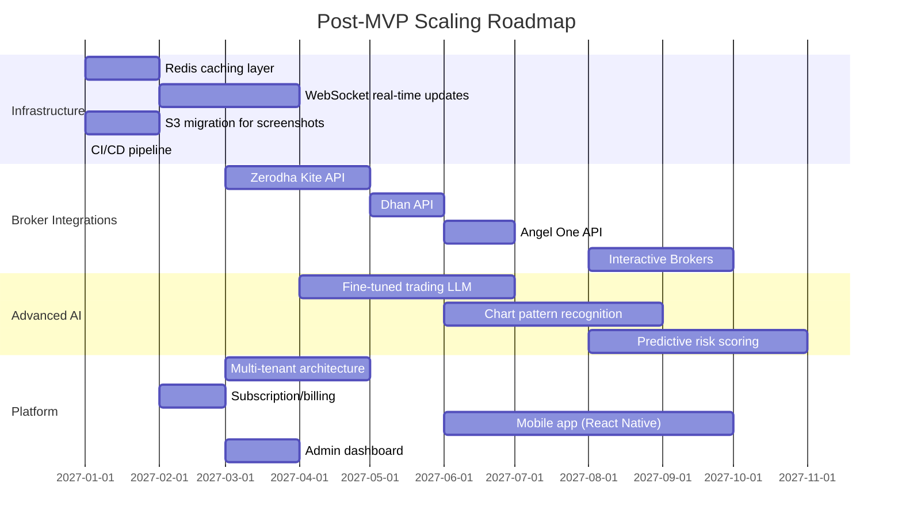

### 13.2 Scaling Decisions

| Trigger | Action | When |
|---|---|---|
| > 100 concurrent users | Add Redis for session caching + API response caching | Phase 14 |
| > 1000 users | Horizontal scaling: Load balancer + 2+ app instances | Phase 15 |
| > 10,000 trades/day | Database read replicas, table partitioning by date | Phase 16 |
| > 100GB screenshots | Migrate to S3 with CloudFront CDN | Phase 14 |
| Real-time features needed | WebSocket server (separate process) | Phase 15 |
| Broker sync volume | Background job queue (Celery + Redis) | Phase 15 |
| Advanced ML needed | Separate ML service, GPU inference | Phase 17+ |

### 13.3 Architecture Evolution Path

```
MVP (Now)                    Short-term                    Long-term
──────────                   ──────────                    ─────────
Modular Monolith     →       Monolith + Redis Cache   →   Service-Oriented
Local File Storage   →       S3/MinIO                 →   CDN + Edge Cache  
REST APIs only       →       REST + WebSocket         →   REST + WS + gRPC
Single DB instance   →       DB + Read Replica        →   Sharded/Partitioned
Template AI          →       GPT-4o-mini              →   Fine-tuned Model
Manual screenshots   →       Broker-synced charts     →   Vision AI analysis
No background jobs   →       Celery + Redis           →   Distributed queue
```

---

## Resolved Decisions

> [!TIP]
> All open questions have been resolved. Implementation is approved.

| # | Decision | Resolution |
|---|---|---|
| 1 | **Market Data Provider** | **Binance API** (free) — crypto only for MVP. Stocks/forex exchanges added later |
| 2 | **LLM Provider** | **Google Gemini** |
| 3 | **Deployment Target** | **Localhost** for development → **AWS EC2 + RDS** for production |
| 4 | **Market Specificity** | **Market-agnostic** — no specific market focus |
| 5 | **Authentication** | Email verification & password reset **deferred to Phase 2** |
| 6 | **Session Detection** | **User's timezone + market hours** (auto-detect) |

---

> [!NOTE]
> **Architecture approved on 2026-06-19.** Implementation has begun.
